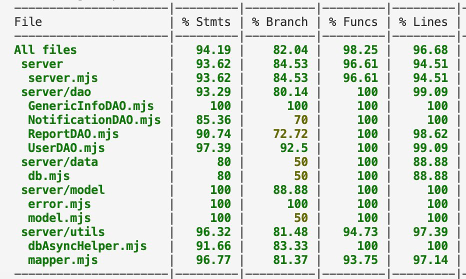

# RETROSPECTIVE (Team 7)

The retrospective should include _at least_ the following
sections:

- [process measures](#process-measures)
- [quality measures](#quality-measures)
- [general assessment](#assessment)

## PROCESS MEASURES

### Macro statistics

- Number of stories committed vs done : 8 vs 8
- Total points committed vs done : 38 vs 38
- Nr of hours planned vs spent (as a team) : 96h vs 90h 35m

**Remember** a story is done ONLY if it fits the Definition of Done:

- Unit Tests passing
- Code review completed
- Code present on VCS
- End-to-End tests performed

> Please refine your DoD

### Detailed statistics

| Story | # Tasks | Points | Hours est. | Hours actual |
| ----- | ------- | ------ | ---------- | ------------ |
| #0    | 19      | -      | 1w 1d 3h   | 1w1d40m      |
| #28   | 1       | 3      | 1h 30m     | 1h 40m       |
| #15   | 2       | 1      | 2h 30m     | 1h 40m       |
| #30   | 3       | 3      | 3h 30m     | 3h 5m        |
| #10   | 10      | 8      | 1d 7h 30m  | 1d 6h 50m    |
| #12   | 6       | 13     | 1d 2h      | 1d 2h 45m    |
| #13   | 4       | 5      | 6h         | 5h 15m       |
| #14   | 6       | 5      | 4h 30m     | 3h 10m       |

> place technical tasks corresponding to story `#0` and leave out story points (not applicable in this case)

- Hours per task (average, standard deviation)

|            | Mean   | StDev  |
| ---------- | ------ | ------ |
| Estimation | 1h 48m | 2h 13m |
| Actual     | 1h 42m | 2h 15m |

- Total task estimation error ratio: -0,056423611

## QUALITY MEASURES

- Unit Testing:
  - Total hours estimated : 4h
  - Total hours spent : 4h 5m
  - Nr of automated unit test cases : 99
  - Coverage : 85.75%
- Integration testing: -> Simulation Testing
  - Total hours estimated : 2h
  - Total hours spent : 2h 15m
- E2E testing:
  - Total hours estimated : 4h
  - Total hours spent : 4h 20m
  - Nr of automated e2e test cases : 141
  - Coverage : 93.24%
- Code review:
  - Total hours estimated : 1h
  - Total hours spent : 50 m
- Technical Debt management:

  - Strategy adopted : Code coverage >= 80% and fix previous issues to obtain at least all B grades in maintainability and reliability
  - Total hours estimated estimated at sprint planning : 4h
  - Total hours spent : 4h

- Total number of tests: 240
- Total coverage 94.19%

## ASSESSMENT

- What caused your errors in estimation (if any)?
  The higher estimation error compared to the previous sprint is due to
  - increased number of stories and smaller tasks
  - telegram bot tasks
- What lessons did you learn (both positive and negative) in this sprint?
  - we managed to keep in touch despite the longer timespan through scrums and almost daily messages
  - we were able to keep up with a higher speed, with more stories compared to the previous sprints
- Which improvement goals set in the previous retrospective were you able to achieve?
  - we managed to decrease the technical debt and deliver a stable and well-made project
  - we managed to decrease the average task size
- Which ones you were not able to achieve? Why?
  - none
- Improvement goals for the next sprint and how to achieve them (technical tasks, team coordination, etc.)

  - no next sprint
    > Propose one or two

- One thing you are proud of as a Team!!
  - Not specifically for this sprint but for the entire semester, we are proud of how we worked as a team, of the connections we made and the quality of our product.
